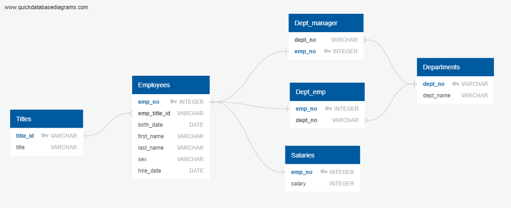

# Creating SQL Database for Employee Data
#### Skills Used: SQL, Postgresql, Entity Relationship Diagram (ERD)
#### Data Source: Generated by Mockaroo, LLC (2022) Realistic Data Generator

## Overview
In this challenge, we wanted to create schemas in postgres SQL to import and store employee data for Pewlett Hackard (a fictional company).  We then wanted to use this database to answer certain queries, such as:
- List the name and hire date for employees hired in 1986
- List the department number of each employee with their employee number, name, and department name
- List the manager of each department along with their name, employee number, department number, and department name

## Database Creation
We wanted to create 6 tables in the SQL database: departments, department employees, department managers, employees, salaries, and titles. To determine the set up of our database, we first created an ERD to map out the different tables and their connections to one another.

   

Once we determined the design of the database, we created the tables in SQL and imported the given CSV files using the Import/Export function in PGAdmin. See "Employee_Schema.sql" file for detailed table information.

## Database Querying
After importing the data, we performed analyses to pull only certain data from the database.  This required joining of multiple tables, filtering of the data, and ordering/grouping the data. See "Employee_Queries.sql" file for detailed searches performed. 
