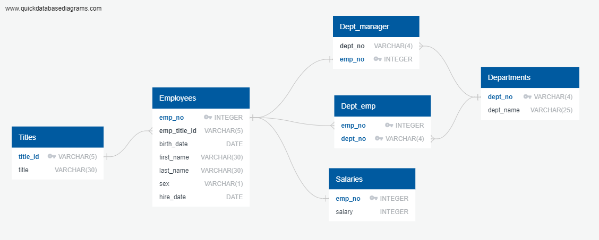

# SQL-challenge
Module 9 Challenge - SQL

## Overview
In this challenge, we created schemas in postgres SQL to import and store employee data for Pewlett Hackard, and then we used this data to perform certain analysis/queries of the data.

We wanted to create 6 tables in the SQL database: departments, department employees, department managers, employees, salaries, and titles. To determine the set up of our database, we first created an ERD to map out the different tables and their connections to one another.

   

Once we determined the design of the database, we created the tables in SQL and imported the given CSV files using the Import/Export function in PGAdmin. See "Employee_Schema" file for detailed table information.

After importing the data, we performed analyses to pull only certain data from the database.  This required joining of multiple tables, filtering of the data, and ordering/grouping the data. See "Employee_Queries" file for detailed searches performed. 